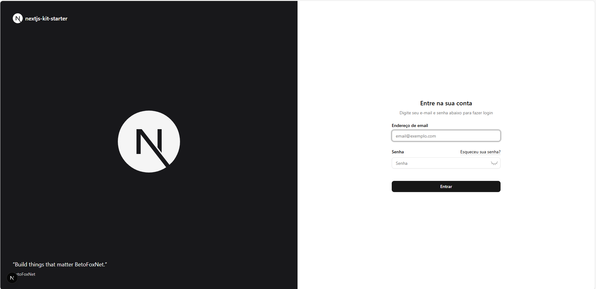
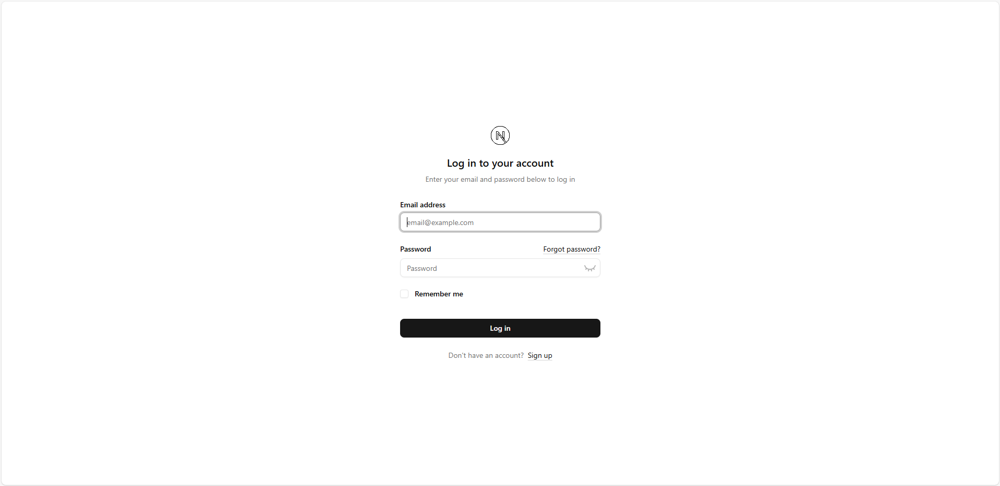
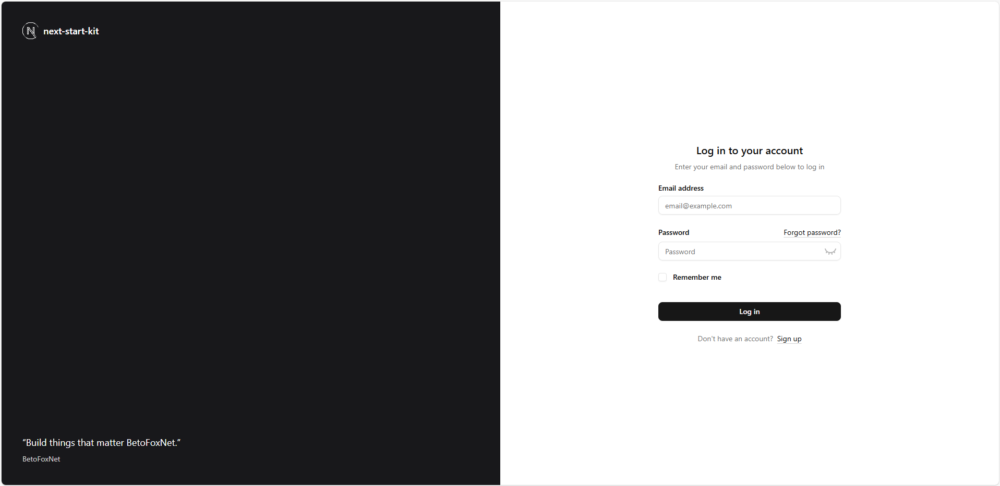
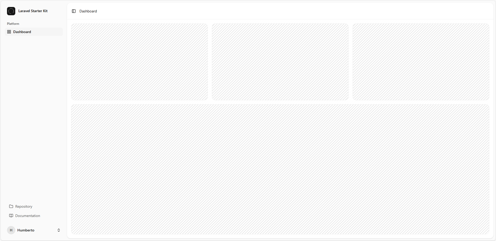
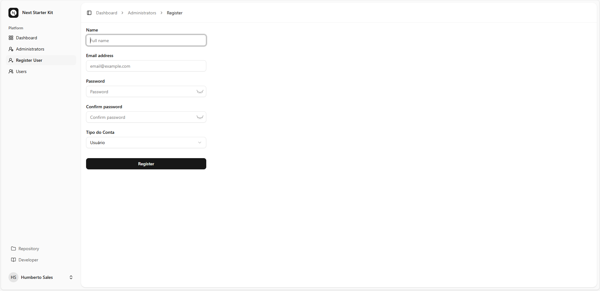
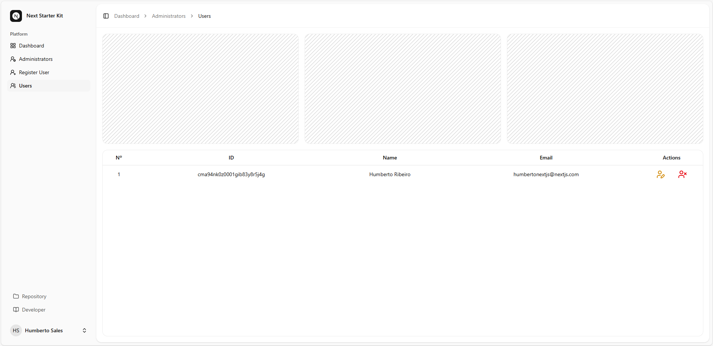

<div align="center">

  <a href="https://betofoxnet-info.vercel.app/"></a>

# BetoFoxNet


  <a href="https://nextjs.org/"></a>

## About NextJS
### Authentication!

</div>

## 👤 Admin Registration Page (Next.js + Prisma)
This project includes a protected admin registration page. The form is only accessible if no admin user exists yet in the database. It’s built with Next.js App Router, Prisma, bcrypt-ts, React Hooks, and Zod validation.

## 📁 File Structure

```bash

/app
  /register
    └── page.tsx                # Redirects if admin exists
    └── form-register-admin.tsx # Client-side admin registration form

/app/api/actions
  └── createadmin.ts           # Server-side logic for admin creation

/lib
  └── prisma.ts                # Prisma client
  └── session.ts               # Session management
  └── definitions.ts           # Zod schema definitions

```

---

## 🚦 Redirect Logic (page.tsx)

```tsx

const isUserAdmin = await prisma.user.findMany({ where: { role: 'ADMIN' } });
if (isUserAdmin.length > 0) redirect('/dashboard');

```

If an ADMIN user already exists, the user is redirected to `/dashboard`.
If not, the admin registration form is shown.

---

## 🧾 Admin Registration Form

### The form includes the following fields:

- Name

- Email

- Password

- Password confirmation

- Role (locked to ADMIN)

### Validation includes:

- Required fields

- Valid email format

- Password match

- Strong password (handled by Zod)

### UX features:

- Show/hide password toggle

- Inline error messages

- Loading spinner in the submit button

---

## 🔐 Server-side Logic (createadmin.ts)

```ts

const hashedPassword = await bcrypt.hash(password, 12);
const user = await prisma.user.create({ data: { name, email, role, password: hashedPassword } });

```

### The createAdmin function:

1. Validates form data using Zod.

2. Hashes the password with bcrypt-ts.

3. Creates the user in the database using Prisma.

4. Automatically starts a session.

On failure, it returns a generic warning that is displayed in the UI.

---

## 📋 How to Use

1. Clone this repository.

2. Set up your environment variables, especially DATABASE_URL.

3. Run the Prisma migrations:

```bash

npx prisma migrate dev

```

4. Start the development server:

```bash

npm run dev

```

5. Visit `http://localhost:3000`.

If no admin exists, the form will appear. Otherwise, you'll be redirected.

---

## ✅ Tech Stack

- Next.js (App Router)

- Prisma ORM

- Zod (form validation)

- bcrypt-ts (password hashing)

- React Hooks

- next-intl (internationalization)

- lucide-react (icons)

---

## 💡 Notes

- The registration is one-time only: only allowed if no admin exists.

- The role field is fixed to ADMIN to prevent arbitrary user types.

- All texts are localized using next-intl for multi-language support.

---

## 🧩 Overview

This login module includes:

- A server component (LoginPage) that wraps the login form in a Suspense boundary.

- A client component (LoginClient) that renders the form.

- A server action (loginUser) that handles user authentication securely on the server side.

---

### 📁 File Structure

```pgsql

/login
 ├── page.tsx                <- Server Component (LoginPage)
 ├── login-client.tsx        <- Client Component (Login)
/api/actions/loginuser.ts    <- Server Action for login

```

---

1. 🧠 LoginPage – Server Component

```tsx

import { Suspense } from 'react';
import LoginClient from './login-client';
import LoadingLoginSimple from '@/components/loadings/loading-login-simple';

export const metadata = { title: 'Log in' };

export default function LoginPage() {
    return (
        <Suspense fallback={<LoadingLoginSimple />}>
            <LoginClient />
        </Suspense>
    );
}

```

---

# 2. 🧾 LoginClient – Login Form (Client Component)

### Features:

- Controlled inputs with useState.

- Validation error messages via state.errors.

- Password visibility toggle.

- Loading feedback while submitting.

- Internationalization via next-intl.

- Redirects to /dashboard on success.

### Hooks used:

- useActionState() → Executes loginUser.

- useEffect() → Handles URL query params (like ?status=...).

- useRef() → For setting input focus.

- useRouter() → To programmatically redirect.

### Flow:

- User fills the form → submits it.

- Calls the loginUser server action via useActionState.

- Handles validation errors, messages, and redirection based on result.

---

# 3. 🔐 loginUser – Server Action

```ts

'use server';

import prisma from '@/lib/prisma';
import { FormStateLoginUser, signInSchema } from '@/lib/definitions';
import { compare } from 'bcrypt-ts';
import { createSession } from '@/lib/session';

export async function loginUser(state: FormStateLoginUser, formData: FormData): Promise<FormStateLoginUser> {
    const validatedFields = signInSchema.safeParse({
        email: formData.get('email') as string,
        password: formData.get('password') as string,
    });

    if (!validatedFields.success) return { errors: validatedFields.error.flatten().fieldErrors, };

    const { email, password } = validatedFields.data;

    try {
        const user = await prisma.user.findFirst({ where: { email, deletedAt: null } });

        if (!user) return { warning: 'E-mail ou senha inválidos' };

        const isPasswordValid = await compare(password, user.password);

        if (!isPasswordValid) return { warning: 'E-mail ou senha inválidos' };

        await createSession(user.id, user.role);

        return { message: 'Autenticação bem-sucedida! Redirecionando para o Painel, aguarde...' };
    } catch (error) {
        console.error('Unknown error occurred:', error);
        return { warning: 'Ocorreu um erro desconhecidoAlgo deu errado. Tente novamente mais tarde.' };
    };
}

```

### Key Logic:

- Validates email and password using Zod schema.

- Finds the user in the Prisma database.

- Compares hashed password using bcrypt-ts.

- If successful, creates a session.

- Returns validation errors, warnings, or a success message.

---

# ✅ Requirements

To make everything work, ensure you have:

- ✅ zod for validation (signInSchema).

- ✅ bcrypt-ts for password hashing/comparison.

- ✅ prisma and a User model with fields: email, password, deletedAt.

- ✅ Session handling with createSession(user.id).

---

# 🧪 How to Test

1. Login Failure: Try with invalid credentials → You should see an error.

2. Prefilled email: Visit a URL like ?email=test@example.com&status=created → The form is prefilled and a message is shown.

3. Password Toggle: Click the eye icon to toggle password visibility.

4. Forgot Password: Link appears only when status is not set.

5. Success: On correct login, redirects to `/dashboard`.

---

# 🛡️ Tutorial: JWT Authentication with HTTP-only Cookies in Next.js (App Router)

This authentication system uses:

- jose for JWT signing and verification

- HTTP-only cookies for secure session storage

- Next.js middleware for route protection

- Prisma ORM to fetch authenticated user data

---

# 🧱 Project Structure Overview

The system is divided into three key modules:

1. session.ts – Session management: create, verify, update, and decrypt JWTs

2. getUser.ts – Retrieves the current authenticated user from the database

3. middleware.ts – Protects routes based on session state

---

# 📦 1. session.ts – Session Management with JWT

⚙️ Initial Setup

```ts

import 'server-only';
import { SignJWT, jwtVerify } from 'jose';
import { cookies } from 'next/headers';
import { redirect } from 'next/navigation';

if (!process.env.AUTH_SECRET) throw new Error('SECRET is not defined');
const secretKey = process.env.AUTH_SECRET;
const encodedKey = new TextEncoder().encode(secretKey);

```

- Loads a secret key from the environment (`AUTH_SECRET`)

- This key is used to sign and verify JWTs using `HS256` algorithm

---

# 🔒 Token Lifetime Settings

```ts

const MAX_SESSION_AGE = 24 * 60 * 60;   // 24 hours
const TOKEN_LIFETIME = 15 * 60;        // 15 minutes
const RENEW_THRESHOLD = 5 * 60;        // 5 minutes

```

- TOKEN_LIFETIME: Initial JWT lifespan

- RENEW_THRESHOLD: If JWT has less than this time left, it gets refreshed

- MAX_SESSION_AGE: Absolute max session age (after which user must re-authenticate)

---

# 🔐 createSession(userId: string)

Generates a signed JWT (`valid for 15 minutes`) and sets it in a secure, `HTTP-only` cookie named `sessionAuth`.

```ts

export async function createSession(userId: string): Promise<void> {
    const now = Math.floor(Date.now() / 1000);
    const expTimestamp = now + TOKEN_LIFETIME;
    const expDate = new Date(expTimestamp * 1000);

    const session = await new SignJWT({ userId, role, iat: now })
        .setProtectedHeader({ alg: 'HS256' })
        .setIssuedAt(now)
        .setExpirationTime(expTimestamp)
        .sign(encodedKey);

    (await cookies()).set('sessionAuth', session, {
        httpOnly: true,
        secure: true,
        expires: expDate,
        sameSite: 'lax',
        path: '/'
    });
}

```

## Cookie attributes:

  - `httpOnly`: not accessible from JavaScript (protects from XSS)

  - `secure`: sent only over HTTPS

  - `sameSite: 'lax'`: mitigates CSRF

  - `expires`: 15 minutes from issuance

  - `path: '/'`: valid across the entire site

---

# 🔎 decrypt(session: string)

Decodes and verifies the JWT. Returns the payload or `null` if the token is invalid or expired.

```ts

export async function decrypt(session: string | undefined = '') {
    if (!session) return null;
    try {
        const { payload } = await jwtVerify(session, encodedKey, { algorithms: ['HS256'] });
        return payload;
    } catch (err) {
        console.log('failed to verify session', err);
        return null;
    }
}

```

- Verifies using HS256 with the shared secret

- Handles invalid or missing tokens gracefully

---

# ✅ verifySession()

Checks if a valid session exists. If not, redirects the user to `/login`.

```ts

export async function verifySession(): Promise<{ isAuth: boolean; userId: string; }> {
    const cookie = (await cookies()).get('sessionAuth')?.value;
    const session = await decrypt(cookie);
    if (!session?.userId) redirect('/login');

    return { isAuth: true, userId: String(session.userId) };
}

```

- Returns `{ isAuth: true, userId }` if authenticated

- Otherwise, calls `redirect('/login')`

---

# 🧾 getSession()

Returns the session payload if present and valid, without triggering a redirect.

```ts

export async function getSession() {
    const session = (await cookies()).get('sessionAuth')?.value;
    if (!session) return null;
    return await decrypt(session);
}

```

- Useful for optional authentication or background checks

---

# 🔄 updateSession()

Renews the session cookie if it's about to expire and within allowed max session age.

```ts

export async function updateSession() {
    const sessionToken = (await cookies()).get('sessionAuth')?.value;

    if (!sessionToken) return null;

    const payload = await decrypt(sessionToken);

    if (!payload?.userId || !payload.exp || !payload.iat) return null;

    const now = Math.floor(Date.now() / 1000);
    const timeLeft = payload.exp - now;
    const sessionAge = now - payload.iat;

    if (sessionAge > MAX_SESSION_AGE) {
        (await cookies()).delete('sessionAuth');
        return null;
    }

    if (timeLeft < RENEW_THRESHOLD) {
        const newExp = now + TOKEN_LIFETIME;
        const newExpDate = new Date(newExp * 1000);

        const newToken = await new SignJWT({ userId: payload.userId, role: payload.role, iat: payload.iat })
            .setProtectedHeader({ alg: 'HS256' })
            .setIssuedAt(payload.iat)
            .setExpirationTime(newExp)
            .sign(encodedKey);

        (await cookies()).set('sessionAuth', newToken, {
            httpOnly: true,
            secure: true,
            expires: newExpDate,
            sameSite: 'lax',
            path: '/'
        });
    }
    return { userId: payload.userId, role: payload.role };
}

```

## Renewal Logic:

Checks how much time is left on the current token (`timeLeft`)

If `timeLeft < RENEW_THRESHOLD`, creates a new token without changing the original `iat`

Ensures sessions cannot be extended indefinitely by refreshing within `MAX_SESSION_AGE`

If `MAX_SESSION_AGE` is exceeded, the session is deleted and the user is logged out

```ts

{ userId: string, role: string } | null

```

---

# 👤 2. getUser.ts – Fetch Authenticated User

```ts

import 'server-only';
import { cache } from 'react';
import prisma from './prisma';
import { verifySession } from './session';

```

---

# 📥 getUser()

Fetches the user from the database using the ID from the session.

```ts

export const getUser = cache(async () => {
  const session = await verifySession();
  ...
});

```

- Uses Prisma to get user details

- Wrapped in cache() for server component efficiency

---

# 🛡️ 3. middleware.ts – Route Protection with JWT and Role-Based Access

This middleware protects routes based on session presence and user role.

## 📄 Middleware Code (Latest Version)

```ts

import { NextRequest, NextResponse } from 'next/server';
import { updateSession } from './lib/session';

export default async function middleware(req: NextRequest) {
  const path = req.nextUrl.pathname;

  const isProtectedRoute = path.startsWith('/dashboard');
  const isAdminRoute = path.startsWith('/dashboard/admins');
  const isPublicRoute = ['/login', '/'].includes(path);

  const session = await updateSession();

  if (isProtectedRoute && !session?.userId) {
    return NextResponse.redirect(new URL(`/login?redirect=${encodeURIComponent(path)}`, req.nextUrl));
  }

  if (isPublicRoute && session?.userId && !path.startsWith('/dashboard')) {
    return NextResponse.redirect(new URL('/dashboard', req.nextUrl));
  }

  if (isAdminRoute && session?.role !== 'ADMIN') {
    return NextResponse.redirect(new URL('/dashboard', req.nextUrl));
  }

  return NextResponse.next();
}

export const config = {
  matcher: ['/((?!api|_next/static|_next/image|favicon.ico|sitemap.xml|robots.txt|videos/).*)']
};


```

---

## 🔍 Route Behavior Overview

| Route       | Type                             | Condition	Behavior                                          |
|-------------|----------------------------------|--------------------------------------------------------------|
| Public	    | `/login`, `/`	                   | Redirects to `/dashboard` if session exists                  |
| Protected	  | Routes under `/dashboard`	       | Requires valid session (`userId`) or redirects to login      |
| Admin-only	| Routes under `/dashboard/admins` | Requires role = `'ADMIN'`, otherwise redirects to `/dashboa` |

---

# ⚙️ Middleware Matcher
This config ensures the middleware only runs on relevant routes, skipping static assets and API endpoints:

```ts

export const config = {
  matcher: [
    '/((?!api|_next/static|_next/image|favicon.ico|sitemap.xml|robots.txt|videos/).*)',
  ],
};

```

- <strong>Excludes</strong>: API routes, Next.js static assets, media, and SEO files

- <strong>Applies to</strong>: All other pages (including dynamic ones)

---

# ✅ How to Use It in Your App

### 1. Environment Variable
In your .env file:

 ```ini

 AUTH_SECRET=your_super_secure_secret_key

```

Use a strong, random secret

---

### 2. Login Example

When a user logs in successfully:

```ts

await createSession(user.id);
redirect('/dashboard');

```

---

### 3. Logout Example

To destroy the session:

```ts

(await cookies()).set('sessionAuth', '', { expires: new Date(0) });
redirect('/login');

```

---

### 4. Use getUser() in Server Components

```tsx

import { getUser } from '@/lib/getUser';

export default async function DashboardPage() {
  const user = await getUser();

  return <div>Welcome, {user?.name}</div>;
}

```

---

# 🔐 Security Notes

- JWT is stored in a secure httpOnly cookie → not accessible to JS

- Tokens are short-lived (15 min) and auto-renewed

- Session renewal is handled transparently in middleware

- All protected routes are checked on every request server-side

---

# 📌 Summary

This setup provides:

- Secure session-based authentication with JWT

- Route protection using middleware

- Prisma-based user management

- Automatic session renewal

---

#### Exchange examples:

- To use the card layout:

```tsx

import AuthLayoutTemplate from '@/components/layouts/auth/auth-card-layout';

```

<div align="center">

  

</div>

---

- To use the simple layout:

```tsx

import AuthLayoutTemplate from '@/components/layouts/auth/auth-simple-layout';

```

<div align="center">

  

</div>

---

- To use the split layout:

```tsx

import AuthLayoutTemplate from '@/components/layouts/auth/auth-split-layout';

```

<div align="center">

  

</div>

---

### ✅ Nothing else needs to be changed!

- The component will continue to function normally. The change only affects the appearance of the authentication page.

---

### 🔐 Requisitos

- Each of the templates requires:

Applying the layout with `children`, `title`, and `description` passing the correct properties to the selected layout.

---

### 🧭 Application Layout Templates

> **Page:** `/components/layouts/app-layout.tsx`

---

#### Features:
- Changing templates for the main application layout (`AppLayout`).
- Authentication support with `next-auth`: layout is only rendered if there is an active session.
- Templates receive `user` and `breadcrumbs` as props.
- Child components (`children`) are rendered within the selected layout.

---

### 📁 Available templates

| Template              | Description                                                             |
|-----------------------|-------------------------------------------------------------------------|
| `app-sidebar-layout`  | Layout with navigation sidebar — ideal for dashboards and complex apps. |
| `app-header-layout`   | Fixed header layout at the top — more compact and straightforward.      |

---

### 🔁 How to switch between templates

To change the application's main layout template, **simply replace the layout import** in the `app-layout.tsx` file.

---

#### Exchange examples:

- To use the sidebar layout:

```tsx

import AppLayoutTemplate from '@/components/layouts/app/app-sidebar-layout';

```

<div align="center">

  

</div>

---

- To use the header layout:

```tsx

import AppLayoutTemplate from '@/components/layouts/app/app-header-layout';

```

<div align="center">

  

</div>

---

### ✅ Nothing else needs to be changed

The structure remains the same. The `AppLayout` component renders the chosen layout based on the import, passing in `user`, `breadcrumbs`, and `children`.

---

### 🔒 layout Administrator

<div align="center">

  

</div>

---

<div align="center">

  

</div>

---

<div align="center">

  

</div>

---

<div align="center">

  

</div>

---

## Install packages

Node version 20+

Postgres 16+

---

```bash

git clone -b preview-staging https://github.com/HumbertoFox/next-auth-start-kit.git

```

---


```bash

npm install -g npm@11.3.0

```

---

```bash

npm install

```

---

### Environment Variables

---

```bash

NEXT_URL=
DATABASE_URL=
AUTH_SECRET=
AUTH_URL=
SMTP_HOST=
SMTP_PORT=
SMTP_USER=
SMTP_PASS=

```

---

```bash

npx prisma migrate dev

```

---

### Developed in:

---

<div>

  
  
  
  
  
  
  
  
  
  
  
  
</div>